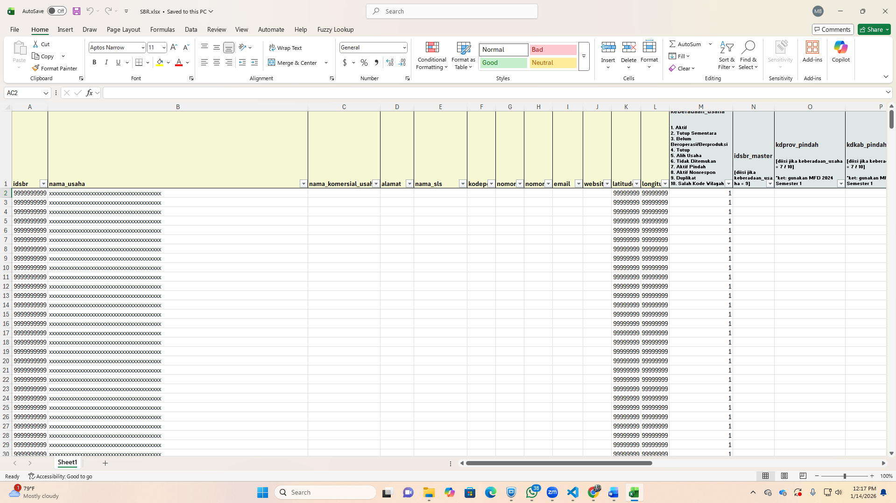

# Panduan Penggunaan GC Automation  
**BPS Kabupaten Buleleng**

---

## Struktur Folder
Pastikan seluruh file berada dalam **satu folder** dengan struktur berikut:

---

## Langkah Penggunaan GC Automation

### 1. Satukan File dalam Satu Folder
Seluruh file aplikasi, template, dan hasil harus berada dalam satu folder yang sama agar aplikasi dapat berjalan dengan baik.

---

### 2. Isi Template Excel
Template Excel dapat diunduh menggunakan **akun viewer / verifikator**.  
Pengguna hanya perlu memperbarui **kolom K, L, dan M** apabila terdapat **koordinat yang tidak sesuai**.

---

### 3. Jalankan Aplikasi
Buka file **`GC Automation BPS Kabupaten Buleleng.exe`**.

---

### 4. Browse Template
Klik tombol **Browse**, kemudian pilih file **Template Excel** yang telah diisi.

---

### 5. Mulai Proses
Klik tombol **Mulai** untuk menjalankan proses GC.

---

### 6. Login SSO
Lakukan login menggunakan **akun SSO**.  
Waktu login dibatasi maksimal **40 detik**.

---

### 7. Proses Selesai
Setelah login berhasil, proses GC akan berjalan hingga selesai.

---

### 8. Update Versi 2
Pada **Versi 2**, status hasil GC dibedakan menjadi:
- **Berhasil**
- **Skip** (kemungkinan sudah dilakukan GC)

---

### 9. Output Hasil GC
Hasil GC akan digenerate secara otomatis dalam file **`hasil.xlsx`** dengan atribut:
- `idsbr`
- `date`
- `nama`
- `status`

Status **SKIP** memiliki dua kemungkinan:
1. Terdapat kendala pada **VPN atau Matchapro**
2. **ID SBR sudah pernah dilakukan GC**, sehingga proses dilewati (skip)

---

## Catatan
- Pastikan koneksi **VPN aktif**
- Jangan menutup aplikasi saat proses GC berlangsung
- Pastikan login SSO dilakukan sebelum batas waktu habis
